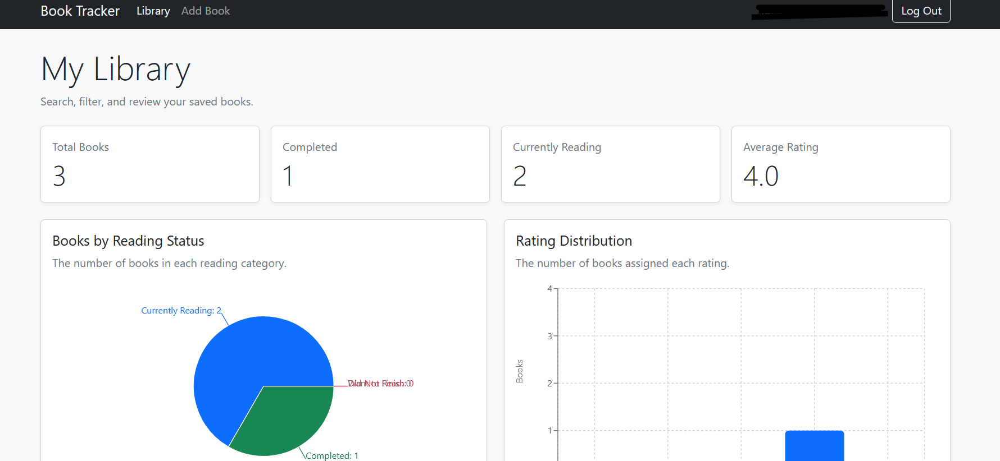
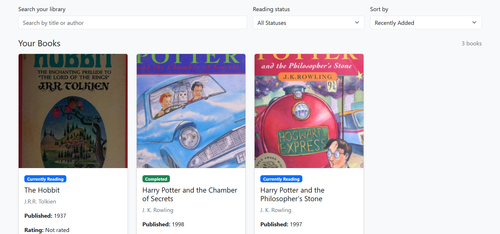
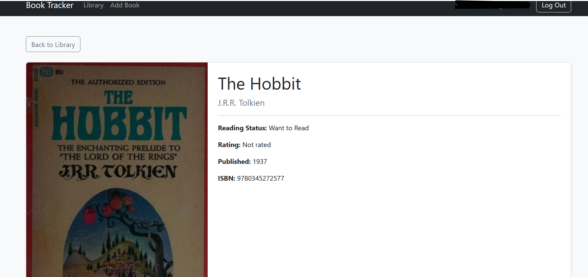

# 📚 Book Tracker

A full-stack book tracking web application built with **React**, **Vite**, and **Firebase** that allows users to build and manage their own personal library.

Users can search for books using public APIs, add books to their library, organize them by reading status, assign ratings, and access their collection from anywhere through Firebase Authentication and Cloud Firestore.

---

## Features

- User authentication with Firebase Authentication
- Personal cloud-based library for each user
- Search for books using Open Library and Google Books
- Add books directly from search results
- Rate books from 1–5 stars
- Track reading status
  - Want to Read
  - Currently Reading
  - Completed
  - Did Not Finish
- View detailed information for each saved book
- Edit reading status and rating
- Remove books from your library
- Real-time synchronization using Cloud Firestore
- Duplicate book prevention
- Responsive design using Bootstrap

---

## APIs Used

### Public APIs

#### Open Library API

Used for searching books and retrieving:

- Title
- Authors
- Cover images
- Publication year

https://openlibrary.org/developers/api

---

#### Google Books API

Used as a fallback and to supplement book information when available.

https://developers.google.com/books

---

### Backend Services

#### Firebase Authentication

Handles:

- User registration
- Login
- Logout
- Persistent authentication

https://firebase.google.com/products/auth

---

#### Cloud Firestore

Stores each user's personal library.

Database structure:

```
users
 └── userId
      └── books
           └── bookId
```

https://firebase.google.com/products/firestore

---

## Frontend Stack

- React
- Vite
- React Router
- Bootstrap 5
- Firebase SDK
- Cloud Firestore
- Firebase Authentication

---

## Installation & Setup

### 1. Clone the repository

```bash
git clone https://github.com/YOUR_USERNAME/book-tracker.git

cd book-tracker
```

---

### 2. Install dependencies

```bash
npm install
```

---

### 3. Create a Firebase project

Create a Firebase project and enable:

- Authentication
  - Email/Password provider
- Cloud Firestore

---

### 4. Create an environment file

Create a file named:

```
.env.local
```

Add your Firebase configuration:

```env
VITE_FIREBASE_API_KEY=your_api_key
VITE_FIREBASE_AUTH_DOMAIN=your_auth_domain
VITE_FIREBASE_PROJECT_ID=your_project_id
VITE_FIREBASE_STORAGE_BUCKET=your_storage_bucket
VITE_FIREBASE_MESSAGING_SENDER_ID=your_sender_id
VITE_FIREBASE_APP_ID=your_app_id

VITE_GOOGLE_BOOKS_API_KEY=your_google_books_api_key
```

---

### 5. Start the development server

```bash
npm run dev
```

---

### 6. Build for production

```bash
npm run build
```

---

### 7. Deploy

If using Firebase Hosting:

```bash
firebase deploy --only hosting
```

---

## Screenshots

_(Add screenshots here once deployed.)_

### Home Page



### Add Book



### Book Details


